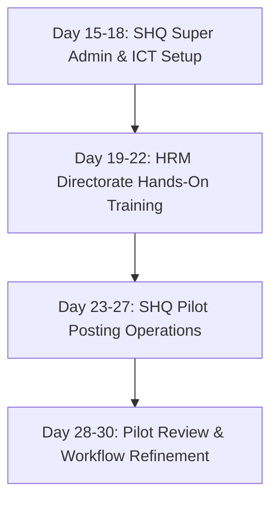
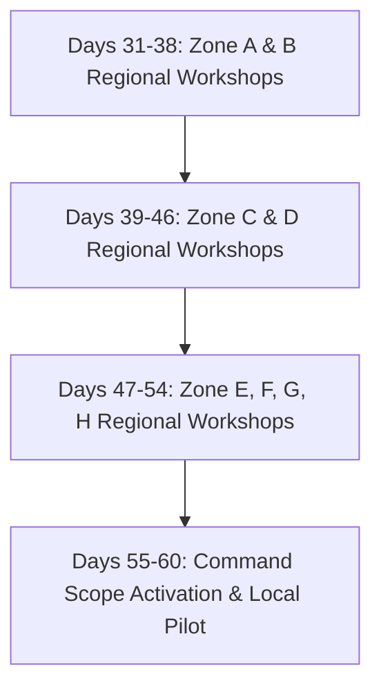
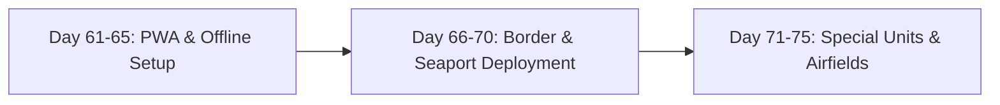
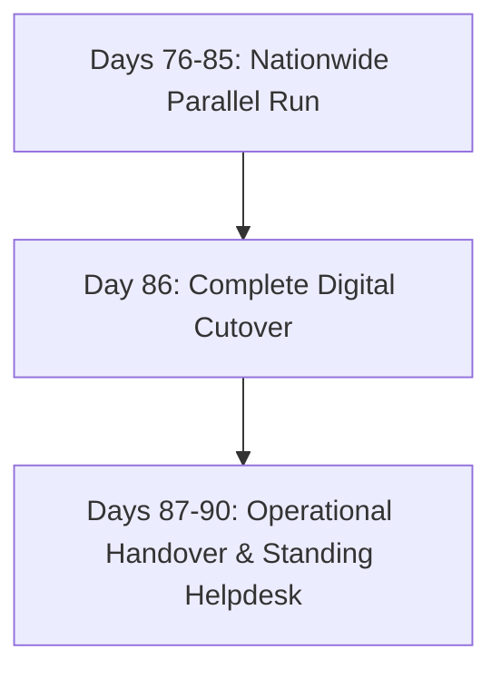

# Nigeria Immigration Service (NIS)
## Personnel Posting Management System (NIS-PPMS)
### Enterprise Implementation Plan & Nationwide Deployment Roadmap

---

> [!IMPORTANT]
> **RESTRICTED IMPLEMENTATION DOCUMENT**
> This operational implementation plan outlines the strategic, technical, and human resource roadmap for deploying the NIS-PPMS platform across Service Headquarters (SHQ), 8 Zonal Commands, 36 State Commands, Seaport Commands, Airport Commands, and Border Patrol Posts.

---

## Executive Summary & Timeline Overview

The **NIS-PPMS Enterprise Rollout Plan** is structured as a **90-Day (13-Week) Phased Implementation Program**. It balances infrastructure readiness, data integrity validation, capacity building, administrative training, and change management to guarantee seamless adoption across all paramilitary formations without interrupting ongoing service operations.

```mermaid
gantt
    title NIS-PPMS 90-Day Master Deployment Schedule
    dateFormat  X
    axisFormat Day %d

    section Phase 1: Prep & Data
    Infra & DB Provisioning       :active, p1, 1, 14d
    Data Cleaning & Migration     :active, p1b, 7, 14d

    section Phase 2: SHQ & Pilot
    SHQ HRM Admin Training        :p2, 15, 22d
    SHQ Pilot Deployment          :p2b, 23, 30d

    section Phase 3: Zones & Commands
    Zonal HQ & Command Training   :p3, 31, 48d
    Nationwide Command Rollout    :p3b, 49, 60d

    section Phase 4: Field Posts
    Border & Special Unit Onboarding:p4, 61, 75d

    section Phase 5: Go-Live
    Parallel Run & Cutover        :p5, 76, 85d
    Full System Handover          :p5b, 86, 90d
```

---

## Master Implementation Schedule (90 Days Total)

| Phase | Phase Title | Target Audience / Module | Duration | Timeline |
| :--- | :--- | :--- | :--- | :--- |
| **Phase 1** | System Provisioning & Data Migration | Infrastructure, Security & Database Teams | **14 Days** | Days 1 – 14 |
| **Phase 2** | SHQ HRM Training & Pilot Deployment | SHQ Directorate of HRM & Service Leadership | **16 Days** | Days 15 – 30 |
| **Phase 3** | Zonal HQ & State Command Rollout | 8 Zonal HQs & 36 State Command Officers | **30 Days** | Days 31 – 60 |
| **Phase 4** | Field Formations & Specialized Units | Border Posts, Marine Commands, Airports | **15 Days** | Days 61 – 75 |
| **Phase 5** | Parallel Run, Cutover & Full Go-Live | Nationwide System Handover & Operational Support | **15 Days** | Days 76 – 90 |

---

## Detailed Phase Breakdown

### Phase 1: Infrastructure Readiness, Data Cleaning & System Provisioning
**Duration**: 14 Days (Days 1 – 14)  
**Objective**: Establish secure enterprise hosting, clean legacy deployment databases, and verify security protocols.

#### Key Tasks & Schedule:
* **Days 1 – 4**: Provision primary and backup enterprise web servers (PHP 8.2+, MariaDB 10.6+), install SSL/TLS encryption certificates, and configure firewall parameters.
* **Days 5 – 8**: Database schema creation (`tbl_emppersonal`, `tbl_employment`, `posting_history`, `disciplinary_board`, `user_zones`), index optimization, and PWA offline Service Worker testing.
* **Days 9 – 12**: Legacy personnel record extraction, CSV data cleaning, verification of Service Numbers, DOB, DOFA, and current posting locations.
* **Days 13 – 14**: Security vulnerability audit (IDOR tokens, 2FA, CSP headers, rate-limiting) and staging environment sign-off.

#### Phase 1 Deliverables:
* Hardened production web environment (`https://nisposting.gov.ng`).
* Sanitized personnel database roster ready for deployment.
* Technical Infrastructure Readiness Certificate.

---

### Phase 2: Service Headquarters (SHQ) HRM Training & Pilot Deployment
**Duration**: 16 Days (Days 15 – 30)  
**Objective**: Train SHQ Human Resource Management (HRM) Directorate, Board Secretaries, and Super Admin personnel; execute pilot posting operations at Headquarters.

#### Key Tasks & Schedule:
* **Days 15 – 18: System Administrator & ICT Training**:
  * Onboard Super Admins and ICT Security Officers.
  * Setup 2FA credentials, user account provisioning, role definitions, and audit log monitoring protocols.
* **Days 19 – 22: SHQ HRM Section Personnel Training**:
  * Intensive hands-on workshop for HRM Directorate officers, Posting Board Desk Officers, and Disciplinary Review Officers.
  * **Curriculum**: Single posting updates (`/editp`), posting order reference numbers, document PDF uploads, Disciplinary Board locking (`/disciplinary`), and 5+ year over-stay recommendation reports (`/analytics`).
* **Days 23 – 27: SHQ Pilot Deployment Run**:
  * Execute real live pilot posting batch using recent SHQ posting orders.
  * Validate automated multi-channel dispatch (SMS, Email, and Destination Command Bell Alerts).
* **Days 28 – 30: Pilot Evaluation & Refinement**:
  * Review user feedback from HRM Desk Officers, adjust operational parameters, and issue SHQ System User Certifications.

#### Phase 2 Deliverables:
* Fully certified SHQ HRM operational workforce.
* Active SHQ pilot deployment in production.
* Disciplinary Board module populated with initial active case records.

---

### Phase 3: Zonal Headquarters & State Command Officer Training & Deployment
**Duration**: 30 Days (Days 31 – 60)  
**Objective**: Train Zonal Command Officers across all 8 NIS Zones (Zones A through H) and 36 State Commands; roll out localized access control.

#### Key Tasks & Schedule:
* **Days 31 – 38: Zone A (Ikeja) & Zone B (Kaduna) Training Workshops**:
  * Conduct regional training for Zonal Command Officers, State Command Desk Officers (Lagos, Ogun, Kano, Kaduna, Sokoto, Katsina, etc.).
  * **Training Focus**: Command Dashboard filtering, receiving incoming posting notifications, 30-day assumption of duty confirmation, and localized personnel verification.
* **Days 39 – 46: Zone C (Bauchi) & Zone D (Minna) Training Workshops**:
  * Train Command Officers across Borno, Adamawa, Plateau, Niger, Kwara, FCT Command, etc.
* **Days 47 – 54: Zone E (Owerri), Zone F (Ibadan), Zone G (Benin) & Zone H (Makurdi) Workshops**:
  * Complete zonal training for Rivers, Akwa Ibom, Oyo, Ondo, Edo, Anambra, Benue, Nasarawa Commands.
* **Days 55 – 60: Command Scope Activation & Zone Verification**:
  * Provision command-specific user accounts (`user_zones`), linking each Command Officer strictly to their assigned geographical scope.
  * Execute test incoming posting confirmations across all 36 State Commands.

#### Phase 3 Deliverables:
* 8 Zonal Headquarters and 36 State Commands onboarded to NIS-PPMS.
* Command-level role assignments and secure user credentials issued.
* Regional deployment certification sign-offs.

---

### Phase 4: Border Posts, Marine Commands & Specialized Unit Onboarding
**Duration**: 15 Days (Days 61 – 75)  
**Objective**: Deploy NIS-PPMS PWA offline mode to remote Border Control Posts, Marine Commands, International Airports, and Training Colleges.

#### Key Tasks & Schedule:
* **Days 61 – 65: Offline PWA & Low-Bandwidth Provisioning**:
  * Configure Progressive Web App (PWA) offline Service Workers (`sw.js`) and asset caching for remote border posts with low network connectivity.
  * Install building interface UI (`offline.html`) and local caching mechanisms.
* **Days 66 – 70: Land Border & Marine Command Rollout**:
  * Onboard command officers at Seme Border, Idiroko Border, Illela Border, Jibia Border, Mfum Border, Lagos Marine Command, and Rivers Marine Onne.
* **Days 71 – 75: International Airports & Special Institutions**:
  * Deploy access for MMIA Lagos, Nnamdi Azikiwe International Airport Abuja, Immigration Training School Kano (ITSK), and Staff College Command.

#### Phase 4 Deliverables:
* Operational connectivity across all strategic Land Borders, Seaports, and Airports.
* PWA Offline Mode active across remote border commands.

---

### Phase 5: Nationwide Parallel Run, Full Go-Live & Post-Deployment Support
**Duration**: 15 Days (Days 76 – 90)  
**Objective**: Execute 10-day dual/parallel posting run, cut over completely to digital-only operations, and establish standing technical support.

#### Key Tasks & Schedule:
* **Days 76 – 85: Nationwide Parallel Run**:
  * Operate NIS-PPMS alongside legacy manual paper registers for 10 consecutive days.
  * Perform daily data reconciliation between physical posting orders and digital records to ensure 100% data consistency.
* **Day 86: Official Digital Cutover (GO-LIVE)**:
  * Formal decommission of paper-based posting approvals.
  * All posting orders, bulk reassignments, and assumption of duty confirmations transitioned exclusively to NIS-PPMS.
* **Days 87 – 90: Post-Implementation Support & Handover**:
  * Activate 24/7 NIS ICT Technical Helpdesk support.
  * Deliver final System Compliance Report to the Comptroller General of Immigration Service (CGIS).

#### Phase 5 Deliverables:
* Full nationwide Go-Live transition to digital NIS-PPMS.
* Decommissioning of legacy manual posting registers.
* Final Project Completion & Handover Report.

---

## Operational Resource Allocation & Change Management

### 1. Hardware & Connectivity Requirements:
* **Service Headquarters**: Enterprise Dedicated Server, High-speed fiber optic connection, dual UPS power backup.
* **Zonal & State Commands**: Standard Desktop/Laptop Workstations, 4G LTE Wi-Fi Routers, document scanners for order PDFs.
* **Border Control Posts**: Tablet/Mobile devices supporting PWA Offline caching for offline personnel lookup.

### 2. Training Strategy & Methodology:
* **Train-the-Trainer (TTT)**: High-performing ICT officers trained during Phase 2 serve as Assistant Lead Trainers for Phase 3 regional workshops.
* **Interactive Practical Simulations**: Every participant executes 5 live scenarios (Adding Officer, Disciplinary Lock, Single Posting, Bulk CSV Upload, and Watermarked Report Printing).
* **Reference Materials**: Physical and digital copies of the **NIS-PPMS Official User Manual & Operational Guide** distributed to all participants.

### 3. Risk Management & Contingency Plan:

| Potential Risk | Impact Level | Risk Prevention & Mitigation Strategy |
| :--- | :--- | :--- |
| **Network Outage at Remote Border Posts** | Medium | PWA Offline Mode (`sw.js`) automatically serves cached officer data and queuing requests until connection restores. |
| **Data Entry Errors during Bulk Upload** | High | System pre-validation check verifies Service Numbers and Disciplinary status before committing database transactions. |
| **Resistance to Digital Transition** | Medium | Executive directive issued by CGIS enforcing mandatory digital posting reference numbers on all official movement orders. |
| **User Credential Compromise** | High | Mandatory 2FA TOTP enforcement for Admin, Super Admin, and SHQ accounts. |

---

### Project Approval & Sign-Off
*Implementation Plan Prepared for Nigeria Immigration Service &bull; NIS-PPMS Deployment v2.4*
