# Nigeria Immigration Service (NIS)
## Personnel Posting Management System (NIS-PPMS)
### Official Master User Manual & Operational Guide (v2.4)

---

> [!IMPORTANT]
> **RESTRICTED & CLASSIFIED DOCUMENT**
> This master operational guide is prepared for authorized Nigeria Immigration Service (NIS) personnel, Command Officers, Directorate Secretaries, and System Administrators. Unauthorized access, duplication, or distribution is strictly prohibited under Service Regulations.

---

## Table of Contents
1. [Executive Overview & System Architecture](#1-executive-overview--system-architecture)
2. [User Roles & Access Control Matrix (RBAC)](#2-user-roles--access-control-matrix-rbac)
3. [Authentication, 2FA & Session Hardening](#3-authentication-2fa--session-hardening)
4. [Executive Dashboard & Intelligence Cards](#4-executive-dashboard--intelligence-cards)
5. [Personnel Roster & Advanced Search Engine](#5-personnel-roster--advanced-search-engine)
6. [Single Officer Posting Workflow & Document Management](#6-single-officer-posting-workflow--document-management)
7. [Disciplinary Board & Sensitive Posting Guards](#7-disciplinary-board--sensitive-posting-guards)
8. [Bulk CSV Posting Workflow & Pre-Validation](#8-bulk-csv-posting-workflow--pre-validation)
9. [Analytics Hub & 5+ Year Over-Stay Recommendation Engine](#9-analytics-hub--5-year-over-stay-recommendation-engine)
10. [Custom Reports & Watermarked Classified Printing](#10-custom-reports--watermarked-classified-printing)
11. [Multi-Channel Notifications & 30-Day Escalation Engine](#11-multi-channel-notifications--30-day-escalation-engine)
12. [Offline PWA Engine & Building Background UI](#12-offline-pwa-engine--building-background-ui)
13. [System Administration, Formation Setup & Security Audit Logs](#13-system-administration-formation-setup--security-audit-logs)
14. [System Settings Portal & Global RESTful API Gateway](#14-system-settings-portal--global-restful-api-gateway)
15. [Role & Granular Permission Management Portal](#15-role--granular-permission-management-portal)

---

## 1. Executive Overview & System Architecture

The **Nigeria Immigration Service Personnel Posting Management System (NIS-PPMS)** is an enterprise web application designed to track, analyze, deploy, and manage the nation-wide staffing of NIS personnel across Service Headquarters directorates, 8 Zonal Commands (Zones A through H), 36 State Commands, Seaport Commands, Airport Commands, and Border Control Posts.

```mermaid
graph TD
    A["NIS-PPMS Enterprise Core"] --> B["Security & 2FA Layer"]
    A --> C["Personnel Roster & Search Engine"]
    A --> D["Posting Operations & Order Docs"]
    A --> E["Disciplinary Board & Posting Guards"]
    A --> F["Analytics & 5+ Yr Over-Stay Engine"]
    A --> G["Classified Watermarked Printing"]
    A --> H["PWA Offline Engine & Building UI"]
    A --> I["Multi-Channel Notifications & 30-Day Escalation"]
    A --> J["Super Admin & Admin System Settings Portal"]
    A --> K["Role & Granular Permission Portal (/roles)"]
    A --> L["Global RESTful API Gateway (/api/v1/)"]
```



### Core Architectural Features
* **Extensionless Clean Routing**: Standard URL navigation without exposing `.php` file extensions (`/dashboard`, `/search`, `/analytics`, `/disciplinary`, `/ssettings`, `/roles`).
* **Role & Granular Permission Portal**: Dedicated security management center (`roles.php`) under *Account & System Help*, exclusive to Super Admins and System Administrators.
* **Super Admin & Admin System Settings Portal**: Master control center (`ssettings.php`) strictly restricted to Admin & Super Admin accounts (removed from Service HQ role).
* **Global RESTful API Gateway**: High-performance RESTful API (`/api/v1/`) enabling external applications worldwide to securely share and receive personnel, posting, and disciplinary data.

---

## 2. User Roles & Access Control Matrix (RBAC)

The application enforces a **Role-Based Access Control (RBAC)** security hierarchy with granular per-user overrides:

| Module / Feature | Super Admin | Admin | Service HQ (SHQ) | Zone / Command Admin | User (Read-Only) |
| :--- | :---: | :---: | :---: | :---: | :---: |
| **Role & Permission Portal (`/roles`)** | ✅ **Exclusive** | ✅ **Exclusive** | ❌ Blocked | ❌ Blocked | ❌ Blocked |
| **System Settings Portal (`/ssettings`)** | ✅ **Exclusive** | ✅ **Exclusive** | ❌ Blocked | ❌ Blocked | ❌ Blocked |
| **API Key Generation & Revocation** | ✅ Allowed | ✅ Allowed | ❌ Blocked | ❌ Blocked | ❌ Blocked |
| **Maintenance Mode Control** | ✅ Allowed | ✅ Allowed | ❌ Blocked | ❌ Blocked | ❌ Blocked |
| **View Dashboard & Metrics** | ✅ Full | ✅ Full | ✅ Full | ✅ Command Scope | ✅ Read-Only |
| **Search Personnel Records** | ✅ Full | ✅ Full | ✅ Full | ✅ Command Scope | ✅ Read-Only |
| **Update Single Posting (`/editp`)** | ✅ Allowed | ✅ Allowed | ✅ Allowed | ❌ Blocked | ❌ Blocked |
| **Bulk CSV Posting (`/bulk`)** | ✅ Allowed | ✅ Allowed | ✅ Allowed | ❌ Blocked | ❌ Blocked |
| **Disciplinary Board (`/disciplinary`)** | ✅ Full Access | ✅ Full Access | ✅ Full Access | ❌ Blocked | ❌ Blocked |

---

## 15. Role & Granular Permission Management Portal (`/roles`)

Accessible **ONLY** to logged-in users with **Super Admin** or **Admin** roles via the sidebar navigation item **"Role & Permission"** under *Account & System Help*.

```
+-----------------------------------------------------------------------------------+
| ROLE & GRANULAR PERMISSION MANAGEMENT PORTAL                                      |
+-----------------------------------------------------------------------------------+
| [ User Roles & Permissions (Give/Deny) ] [ Default Role Matrix ] [ Permission Registry ] |
+-----------------------------------------------------------------------------------+
|  USER ROLES & PERMISSIONS TABLE                                                   |
|  #ID | Username    | Full Name       | Assigned Role | Status  | Permissions Badges|
|  #1  | admin       | System Admin    | Super Admin   | Active  | Full System Access|
|  #2  | ezeab       | Eze Abayomi     | Super Admin   | Active  | Full System Access|
|  #3  | officer_jo  | Joseph Okafor   | Command User  | Active  | 3 Granted, 1 Denied|
|                                                                                   |
|  [ MANAGE ROLE & PERMISSIONS BUTTON ] -> Opens Give / Deny Permission Editor Modal |
+-----------------------------------------------------------------------------------+
```

### Key Capabilities:
1. **Per-User Permission Overrides (Give or Deny)**:
   - System Administrators can select any new or existing user account and explicitly **GRANT** or **DENY** specific system permissions (`view_dashboard`, `search_personnel`, `edit_posting`, `bulk_posting`, `manage_disciplinary`, `view_analytics`, `view_reports`, `manage_users`, `system_settings`, `roles_permissions`, `api_access`).
   - Explicit per-user overrides take precedence over standard role defaults.
2. **Account Status & System Role Updates**:
   - Change assigned system roles dynamically (e.g. promote standard User to Command Admin or SHQ Admin).
   - Enable or suspend user accounts in real time.
3. **Default Role Permission Matrix**:
   - Customize default baseline permissions granted to each system role.
4. **System Permission Registry**:
   - Register custom permissions and module keys.

---

### Official Release & System Verification
*Nigeria Immigration Service &bull; Personnel Posting Management System (NIS-PPMS) v2.4*
